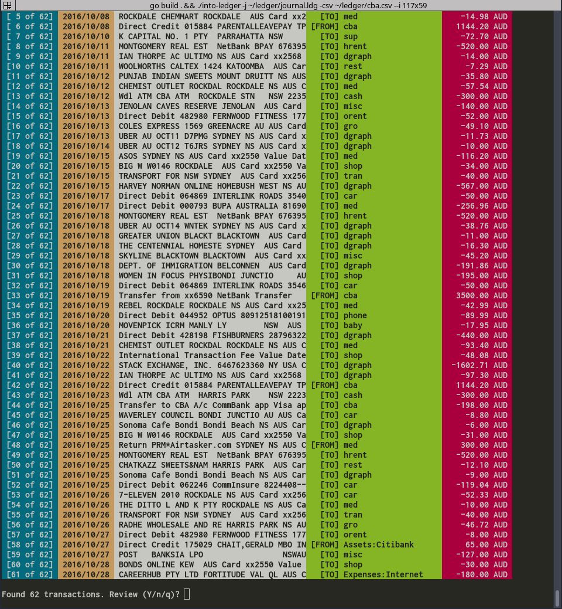
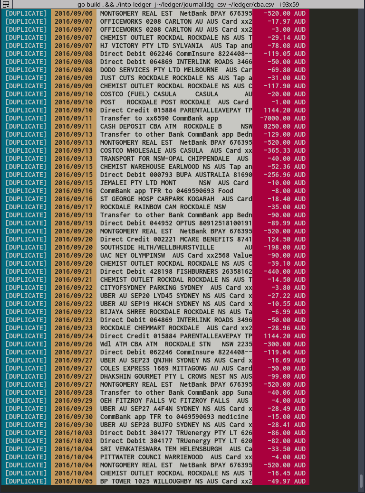
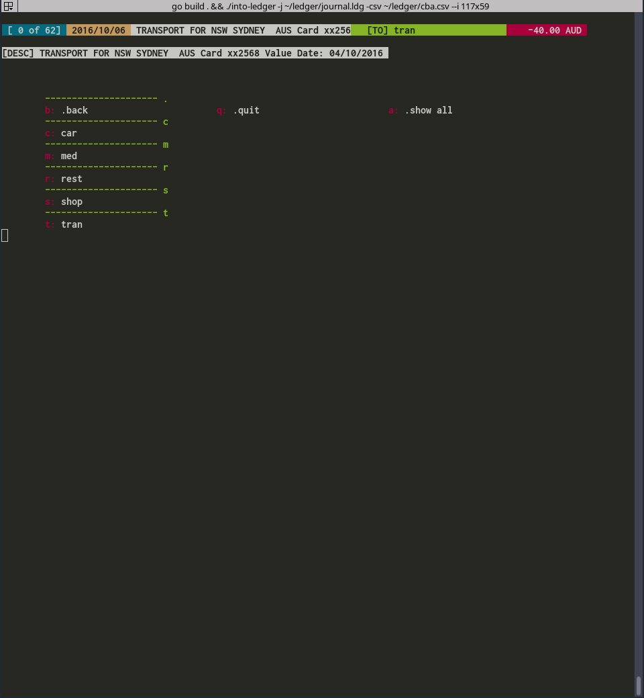

into-ledger
-----------
into-ledger helps categorization of CSV transactions and conversion into ledger format for consumption by [ledger-cli.org](http://ledger-cli.org/). It makes importing hundreds of transactions into ledger a breeze. I typically get close to a hundred transactions per account per month myself, which is why I wrote this tool.

Features:
- *Accurate*             : Uses a much more accurate tf-idf expense classifier than used by cantino/reckon.
- *Includes and Aliases* : Correctly parses your existing journal file, handling all includes and account aliases.
- *Keyboard Shortcuts*   : Assigns dynamic keyboard shortcuts, so classifying transactions is just a keystroke away.
- *Auto save*            : Uses temporary storage (boltdb) to persist transactions that you have categorized or acknowledged to be correctly categorized, so you can quit whenever you want, without the risk of losing the work done so far.
- *Deduplication*        : Deduplicates incoming transactions from CSV against the transactions already present in ledger journal. This allows an easy resume from a broken workflow.
- *Nice UI*              : Colors and formatting, because it's not just about getting things done. It's also about making them look nice!


Install
-------

`go get -v -u github.com/manishrjain/into-ledger`


Help
----
```
Usage of into-ledger:
  -a string
    	Name of bank account transactions belong to.
  -c string
    	Set currency if any.
  -conf string
    	Config directory to store various into-ledger configs in. (default "/home/mrjn/.into-ledger")
  -csv string
    	File path of CSV file containing new transactions.
  -d string
    	Defaults to MM/DD/YYYY. Express your date format w.r.t. Jan 02, 2006. See: https://golang.org/pkg/time/ (default "01/02/2006")
  -debug
    	Additional debug information if set.
  -ic string
    	Comma separated list of columns to ignore in CSV.
  -j string
    	Existing journal to learn from.
  -o string
    	Journal file to write to. (default "out.ldg")
```


Usage
-----

```
# Importing from Citibank Australia
$ into-ledger -j ~/ledger/journal.ldg -csv ~/ledger/ACCT_464_25_07_2016.csv --ic "3,4" -o out.data -a citi -c AUD -d "02/01/2006"

# Importing from Chase USA
$ into-ledger -j ~/ledger/journal.ldg -csv ~/ledger/Activity.CSV --ic "0,1" -o out.data -a chase -c USD
```

Having to specify these command line arguments over and over again is annoying. So, instead you can create a config file in "$HOME/.into-ledger", like so:

```
accounts:
  chase:
    currency: USD
    journal: /home/mrjn/ledger/journal.ldg
    dateformat: 01/02/2006
    ignore: "0,1"
    output: /home/mrjn/ledger/chase.out
  cba-smart:
    currency: AUD
    journal: /home/mrjn/ledger/journal.ldg
    dateformat: 02/01/2006
    ignore: "3"
    output: /home/mrjn/ledger/cba.out
```

Now you can just run:
`into-ledger -a chase -csv <input-csv>`, or `into-ledger -a cba-smart -csv <input-csv>`

Keyboard Shortcuts
------------------

One of the great advantages of using `into-ledger` is how quickly you can categorize a transaction. Most of the times the underlying categorization algorithm is smart enough to do the right thing for you. However, for the rest, `into-ledger` shows you keyboard shortcuts to pick the right category.

`into-ledger` uses a keys module I wrote, which automatically assigns shortcuts to categories and persists them in `~/.into-ledger/shortcuts.yaml`. However, you might want to use certain keys for certain categories. In that case, feel free to hand-edit the `shortcuts.yaml` file. Just ensure that the same shortcut isn't being used twice in the file.

**Tip:** If you want to assign a shortcut to a category, but it's being used by another category, feel free to delete that category block from the shortcuts file. into-ledger will automatically reassign a new shortcut to the deleted category, and write it back.


Screenshots
-----------

**Parse transactions from CSV, and show automatically picked categories to be reviewed.**



**Detect duplicates transactions in CSV, which are already present in ledger journal.**



**Categorize transaction using persistent and dynamic keyboard shortcuts.**


